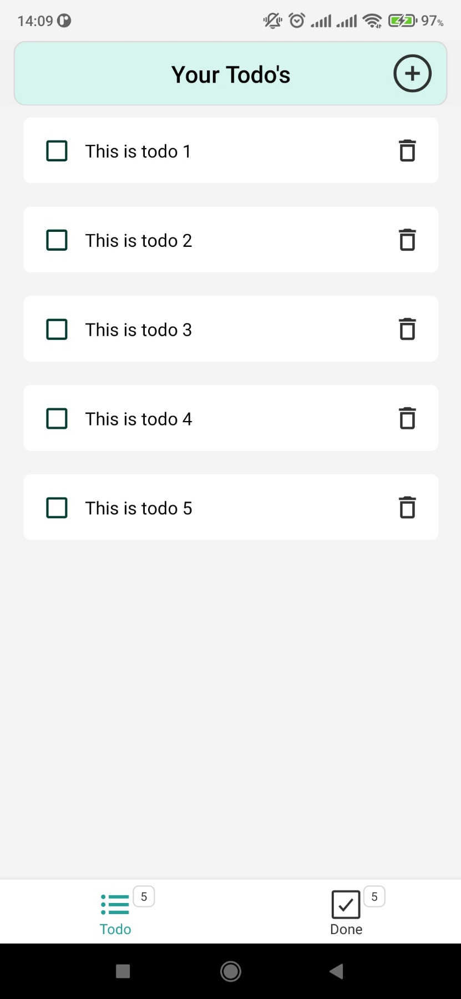
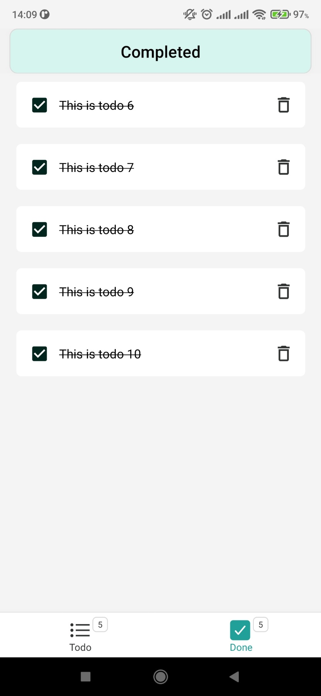
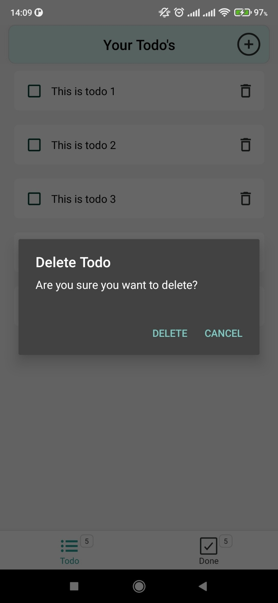
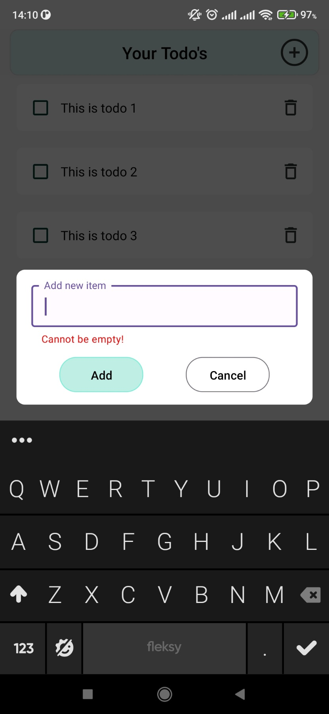
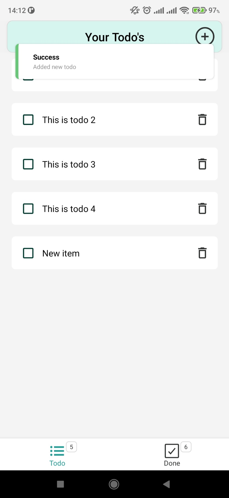

# [Just Do It](https://www.youtube.com/watch?v=HhnLgnXj91Q)

A basic _todo_ app built using React Native CLI for android.  
Uses redux for local state management.  
First ever mobile project.

# Table of Contents

- [Download APK](#download)
- [App functions](#app-functions)
- [Editor Setup](#editor-setup)
- [Development Setup](#development-setup)
- [App Screenshots](#app-screenshots)

# Download

Try out the app on [Android](https://drive.google.com/drive/folders/1SNWb4fauqhf2Iz60k5k5K4NyKhFBnSPx?usp=sharing). Latest version is the one with highest number.

# App Functions

A user is able to:

- Navigate between two screens _(home and completed)_
- Add new todo item
- Delete todo item
- Mark an item as _completed_

# Editor Setup

```
- Prettier
- Code Spell Checker
- ESLint
- commitlint
```

# Development Setup

### Prerequisites

```
- Node.js and NPM
- Android SDK
- JDK v18 (or above)
- Gradle v7.5.1
- Visual Studio Code
- React Native Debugger
```

Run following commands from project root directory to get up and running with development.

### 1. Install dependencies

`npm install`

### 2. Start react native metro bundler

`npx react-native start` || `npm start`

### 3. Build the app on android

`npx react-native run-android` || `npm run android`

# App Screenshots






